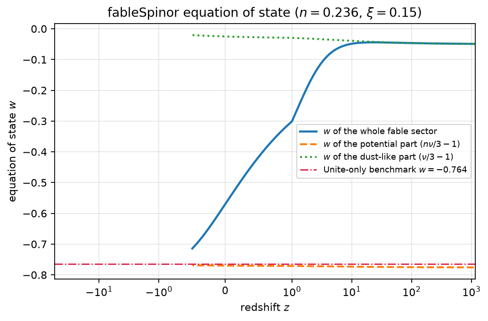
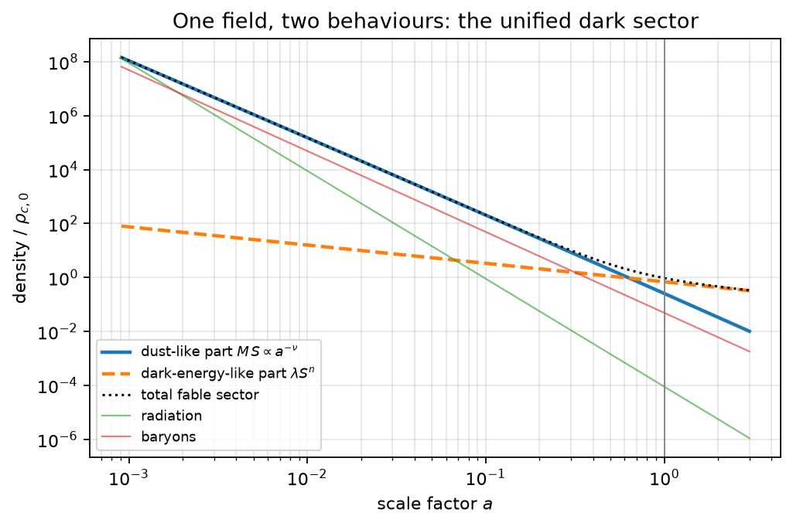
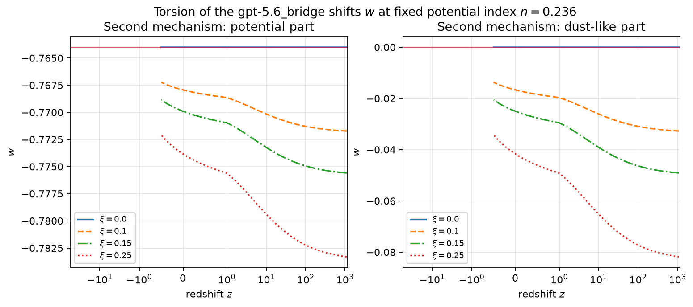
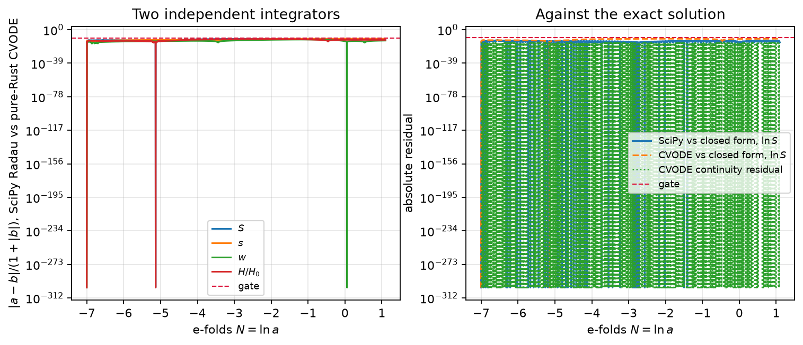

# fableSpinor and the gpt-5.6 bridge

A real 16-component spinor irreducible under the universal cover of the real
$O(4,4)$, a connection that a spinor cannot redefine away, and a unified dark
sector.

This is the Markdown twin of [the compiled report](fable_spinor.pdf), built from
[fable_spinor.tex](fable_spinor.tex).

---

## Abstract

`fableSpinor` is a **real** 16-component field carrying an irreducible
representation of the universal cover of the **real** $O(4,4)$. The
irreducibility is *computed*, not asserted: the commutant of $\mathrm{Pin}(4,4)$
has dimension 1, while that of the connected $\mathrm{Spin}(4,4)$ has dimension
2. That distinction is not cosmetic — under the connected group alone the
representation splits as $8\oplus8$, so it is the full $O(4,4)$, reflections
included, that makes the sixteen components one object.

The frame field `gpt-5.6f_rame` is built from a normalised order-four Hadamard
generator whose square is the identity, so the group element is available in
closed form with no series. The connection family `gpt-5.6_bridge` promotes its
interpolation parameter from a constant to a scalar **field**. Two exact
transgression identities follow, one carrying a gradient term that no constant
parameter can produce. The whole family contributes a single scalar one-form to
the Dirac operator, removable by a spinor rescaling exactly when an obstruction
two-form vanishes — which it does for Levi-Civita, for Weitzenböck, and for
every constant interpolation, and does **not** for a bridge field varying
transverse to the torsion potential.

The background cosmology of `fableSpinor` is integrated three independent ways
that agree to $3.6\times10^{-11}$. A single field is pressureless early and
dark-energy-like today, and its massless torsion-free limit has a flat,
non-evolving $w=n-1$, exactly $-0.764$ at $n=0.236$.

---

## 1. The canonical 4+4 bridge

### 1.1 Frame field

Tangent metric $\eta_{ab}=\mathrm{diag}(1,1,1,1,-1,-1,-1,-1)$. The canonical
frame is diagonal:

$$e_\mu{}^a=\mathrm{diag}\bigl(\tan 6Hx^0,\;q,q,q,\;1,\;p,p,p\bigr),\qquad
q=\frac{e^{-a_4(Hx^4)}}{\sin^{1/6}6Hx^0},\qquad
p=\frac{e^{+a_4(Hx^4)}}{\sin^{1/6}6Hx^0},$$

with $a_4$ free, satisfying $g_{\mu\nu}=e_\mu{}^a\eta_{ab}e_\nu{}^b$. Note
$pq=\sin^{-1/3}6Hx^0$: the two four-blocks carry independent scale factors
subject to one constraint. The metric determinant is $\sec^2 6Hx^0$.

### 1.2 Spin connection

Solving the vielbein postulate
$\partial_\mu e_\nu{}^a-\Gamma^\rho_{\mu\nu}e_\rho{}^a+\omega_\mu{}^a{}_b e_\nu{}^b=0$
with the Levi-Civita $\Gamma$ gives

$$\omega_\mu{}^a{}_b = e_\nu{}^a\Gamma^\nu_{\mu\rho}e^\rho{}_b - e_\nu{}^a\partial_\mu e^\nu{}_b .$$

There are **37** nonzero Christoffel symbols of 512 and **24** nonzero
spin-connection components of 512. The connection is antisymmetric in its flat
pair, metric compatible and torsion free; the postulate residual is identically
zero.

### 1.3 Spinor covariant derivative

$$D_\mu\psi=\partial_\mu\psi+\tfrac18\omega_{\mu ab}[\gamma^a,\gamma^b]\psi
=\partial_\mu\psi+\tfrac12\omega_{\mu ab}S^{ab}\psi,\qquad S^{ab}=\tfrac14[\gamma^a,\gamma^b].$$

Each $\gamma^a$ is block off-diagonal in the parity grading, so every commutator
$[\gamma^a,\gamma^b]$ is block diagonal and the derivative preserves the
eight-dimensional type-one block.

---

## 2. The gpt-5.6 bridge

### 2.1 `gpt-5.6f_rame`

With $R$ the normalised order-four Hadamard matrix,

$$J=\begin{pmatrix}0&R\\R^{\mathsf T}&0\end{pmatrix},\qquad
J^{\mathsf T}\eta+\eta J=0,\qquad J^2=\mathbb{1}_8 .$$

The first identity puts $J$ in $\mathfrak{so}(4,4)$; the second removes the need
for a series:

$$\Lambda(u)=\cosh u\,\mathbb{1}+\sinh u\,J,\qquad \Lambda^{\mathsf T}\eta\Lambda=\eta .$$

This is a simultaneous equal-rapidity boost in all four orthogonal $(+,-)$
planes. The frame $e\cdot\Lambda(u)$ reconstructs the same curved metric for
every $u$, reduces to the canonical frame at $u=0$, and unlike the diagonal
canonical frame is **dense**: it mixes the $+4$ and $-4$ blocks.

### 2.2 `gpt-5.6_bridge`

With $K=\Gamma_{\mathrm W}-\Gamma_{\mathrm{LC}}$ a tensor,
$\Gamma(h)=\Gamma_{\mathrm{LC}}+hK$ is a connection for any scalar $h$, and with
$h(s)=3s^2-2s^3$ the endpoints are exact: $h=0$ is Levi-Civita, $h=1$ is
Weitzenböck.

Nothing required $h$ to be constant. Promote it to a field $h(s(x))$: the
product is still a tensor, so this is still a metric-compatible
$\mathfrak{so}(4,4)$ connection, and in the canonical frame
$\omega_{\mathrm{bridge}}=(1-h(s(x)))\,\omega_{\mathrm{canonical}}$.

### 2.3 Two exact transgression identities

$$T = h\,T_{\mathrm{Weitzenb\ddot{o}ck}},$$

$$R = R_{\mathrm{LC}} + h\,D_{\mathrm{LC}}K + h^2\,K\wedge K + \mathrm{d}h\wedge K .$$

The first holds for constants too. The last term of the second is **new**: it is
identically zero for every constant parameter, so no member of the
constant-parameter family reproduces it.

### 2.4 A criterion that fails, and one that works

Seeking superiority in the **axial** torsion fails, and the failure is recorded
rather than omitted: since the bridge torsion is a scalar multiple of the
Weitzenböck torsion, and the Weitzenböck axial part vanishes identically, so
does the bridge's. Both statements are assertions in the test suite so the
negative result cannot be quietly forgotten.

What does work is **removability**. With torsion potential
$\mathcal T=\log\sin 6Hx^0$, the whole family contributes one scalar one-form:

$$\gamma^\mu\Gamma^{\mathrm{spin}}_\mu=-\tfrac12(1-h)\,\partial_\mu\mathcal T\,\gamma^\mu ,$$

which a rescaling $\psi\to e^{-F}\psi$ absorbs if and only if it is exact, that
is if and only if

$$\Omega=\mathrm{d}\bigl[(1-h)\,\mathrm{d}\mathcal T\bigr]=\tfrac12\,\mathrm{d}h\wedge\mathrm{d}\mathcal T = 0 .$$

| connection | $\Omega$ | consequence |
|---|---|---|
| canonical Levi-Civita, $h=0$ | $0$ | removable by a rescaling |
| Weitzenböck, $h=1$ | $0$ | the connection vanishes outright |
| any constant bridge parameter | $0$ | removable by a rescaling |
| **bridge field, $\partial h\nparallel\partial\mathcal T$** | $\neq0$ | **irremovable** |

Since $\mathcal T$ depends on $x^0$ alone, any bridge field with
$\partial_4h\neq0$ gives a nonzero obstruction. For
$s=\tfrac12+\tfrac14\tanh x^4$:

$$\Omega_{x^0x^4}=\frac{9H\cot(6Hx^0)\,\mathrm{sech}^2(x^4)\bigl(\tanh^2(x^4)-4\bigr)}{32}\neq0 .$$

This is the measurable sense in which `gpt-5.6_bridge` is superior: it is the
only entry a spinor cannot be redefined to ignore.

---

## 3. fableSpinor

### 3.1 Definition and irreducibility

The generators of $\mathrm{Cl}(4,4)$ are raising and lowering operators on the
exterior algebra of $\mathbb{R}^4$: four square to $+1$ and are symmetric, four
square to $-1$ and are antisymmetric, and every entry is an **integer**.

$O(4,4)$ is generated by reflections, whose lifts are the $\gamma^a$ themselves
and which generate $\mathrm{Pin}(4,4)$; the even part is $\mathrm{Spin}(4,4)$.
By real Schur's lemma a representation is absolutely irreducible over
$\mathbb{R}$ exactly when its commutant is one-dimensional.

| group | commutant dimension | verdict |
|---|---|---|
| $\mathrm{Pin}(4,4)$, the universal cover of the real $O(4,4)$ | **1** | absolutely irreducible |
| $\mathrm{Spin}(4,4)$, the connected subgroup | **2** | reducible, $16=8\oplus8$ |

The chirality operator commutes with every $S^{ab}$ but anticommutes with every
$\gamma^a$, so a reflection exchanges the two halves and welds them into one
irreducible sixteen. Independently, the 256 Clifford words span the full real
$16\times16$ matrix algebra (rank 256) while the 128 even words span exactly
half.

### 3.2 Bilinears

With $C=\gamma^1\gamma^2\gamma^3\gamma^4$: $C^{\mathsf T}=C$ and
$(C\gamma^a)^{\mathsf T}=-C\gamma^a$. For a commuting real field this is exactly
the right pairing — the scalar $S=\Psi^{\mathsf T}C\Psi$ survives, the vector
current $\Psi^{\mathsf T}C\gamma^a\Psi$ vanishes identically, and the kinetic
term is a genuine first-order symplectic form rather than a total derivative.

### 3.3 Lagrangian, field equation, stress tensor

$$\mathcal L=e\Bigl[\tfrac12\bigl(\Psi^{\mathsf T}C\gamma^\mu D_\mu\Psi-(D_\mu\Psi)^{\mathsf T}C\gamma^\mu\Psi\bigr)-MS-V(S)\Bigr],
\qquad \gamma^\mu D_\mu\Psi=(M+V'(S))\Psi .$$

In the homogeneous flat reduction, including the bridge's scalar connection
term, the field equation is

$$\gamma^0\bigl(\dot\Psi+\tfrac32H\Psi-\tfrac12(1-h)\Theta\Psi\bigr)=(M+V'(S))\Psi ,$$

and contracting with $\Psi^{\mathsf T}C$ — using only the symmetry of $C$, the
antisymmetry of $C\gamma^0$, and a **generic** sixteen-component $\Psi$ — gives
the exact dilution law

$$\frac{\mathrm{d}S}{\mathrm{d}N}=-\nu(s)\,S,\qquad \nu(s)=3-\xi\bigl(1-h(s)\bigr),\qquad N=\ln a .$$

The on-shell Lagrangian is $SV'(S)-V(S)$, the energy density is $\rho=MS+V(S)$,
and covariant conservation then fixes the pressure uniquely. For
$V(S)=\lambda S^n$:

| quantity | expression |
|---|---|
| kinetic energy density | $\Psi^{\mathsf T}C\gamma^\mu D_\mu\Psi=(M+V'(S))S$ |
| potential energy density | $\lambda S^n$ |
| energy density | $\rho=MS+\lambda S^n$ |
| pressure | $p=\bigl(\tfrac{\nu}{3}-1\bigr)MS+\bigl(\tfrac{n\nu}{3}-1\bigr)\lambda S^n$ |
| equation of state | $w=p/\rho$ |
| dust-like component | $w_{\mathrm{dust}}=\nu/3-1$ |
| dark-energy-like component | $w_{\mathrm{potential}}=n\nu/3-1$ |

### 3.4 Closed-form background

Closing the system with the bounded, analytically integrable flow
$\mathrm{d}s/\mathrm{d}N=\gamma s(1-s)$ — a phenomenological choice, not a
consequence of an action — the dilution law integrates exactly:

$$s(N)=\frac{s_0e^{\gamma N}}{1-s_0+s_0e^{\gamma N}},\qquad
\ln S(N)=\ln S_0-3N+\frac{\xi}{\gamma}\Bigl[\ln s+s-s^2\Bigr]_{s(0)}^{s(N)} ,$$

using $\bigl(s^{-1}+1-2s\bigr)s(1-s)=1-h(s)$.

---

## 4. Numerical solution

Three independent routes: closed form; `fable_cosmo_rs` driving the vendored
pure-Rust SUNDIALS 7.8.0 CVODE (BDF, Newton, dense, $\mathrm{rtol}=10^{-12}$);
and SciPy Radau. Every comparison is gated and the programs exit nonzero on
violation.

| quantity | measured | gate |
|---|---|---|
| covariant conservation residual | $1.194042\times10^{-15}$ | $10^{-13}$ |
| integrators versus the closed form | $3.233014\times10^{-11}$ | $10^{-9}$ |
| SciPy versus CVODE, $\lvert a-b\rvert/(1+\lvert b\rvert)$ | $3.612555\times10^{-11}$ | $10^{-10}$ |
| $\lvert w_{\mathrm{potential}}-(-0.764)\rvert$ at $\xi=0$ | $0$ | $10^{-12}$ |
| $\lvert w_{\mathrm{dust}}\rvert$ at $\xi=0$ | $0$ | $10^{-12}$ |

The last two rows are exact, not merely small.

---

## 5. Is there a connection to dark matter and dark energy?

**Both, from one field.**

At early times $S$ is large and $MS$ dominates; because
$w_{\mathrm{dust}}=\nu/3-1$ vanishes exactly at $\nu=3$, the sector is
pressureless and gravitates as **dark matter**. At late times $S$ is small, and
since $0<n<1$ the term $\lambda S^n$ falls far more slowly and comes to
dominate, with $w_{\mathrm{potential}}=n\nu/3-1$: it gravitates as **dark
energy**. The handover needs no second field and no tuning beyond the choice of
$n$; the numerical solution confirms the transition is monotonic and never
crosses $w=-1$, so the model cannot counterfeit phantom behaviour.

Two independent mechanisms make $w$ evolve:

1. the **potential** mechanism, a generalisation of quintessence: the ratio
   $\lambda S^{n-1}/M$ grows as $a^{3(1-n)}$, moving the total $w$ from $0$
   toward $n-1$;
2. the **geometric** mechanism supplied by `gpt-5.6_bridge`: the bridge field
   enters $\nu$ and shifts both components' $w$ at fixed $n$, giving the
   dark-matter-like component a small negative pressure. Nothing in a pure
   quintessence can do this, and the effect vanishes exactly when the torsion
   coupling is switched off.

Switching the torsion coupling off makes $w_{\mathrm{potential}}$ exactly $n-1$
— a flat, non-evolving equation of state — so $n=0.236$ reproduces $w=-0.764$
with **zero** numerical error, while $w_{\mathrm{dust}}$ is exactly zero. The
Unite-only constant-$w$ benchmark is a clean limit of the model rather than a
fitted output.

---

## 6. What is not claimed

- Only the **background** is computed. No perturbations are evolved, so nothing
  here constrains structure formation or the microwave background.
- No observational dataset is shipped or used. The value $-0.764$ is treated as
  a benchmark to be reproduced as a limit, never as data being fitted; no
  likelihood is evaluated anywhere.
- The flow law for the bridge field is a phenomenological closure chosen for
  smoothness, boundedness and analytic integrability. It is not derived from an
  action.
- `gpt-5.6f_rame` is a pseudo-orthogonal frame gauge transformation. By itself
  it changes no observable; the physical content lies in the connection.
- The axial-torsion criterion **failed**; the superiority claim rests instead on
  containment of both prior geometries as exact endpoints, on the gradient term
  of the curvature transgression, and on irremovability.
- Agreement among three solvers establishes numerical correctness, not physical
  correctness.
- No claim is made that a new fundamental particle has been detected.
