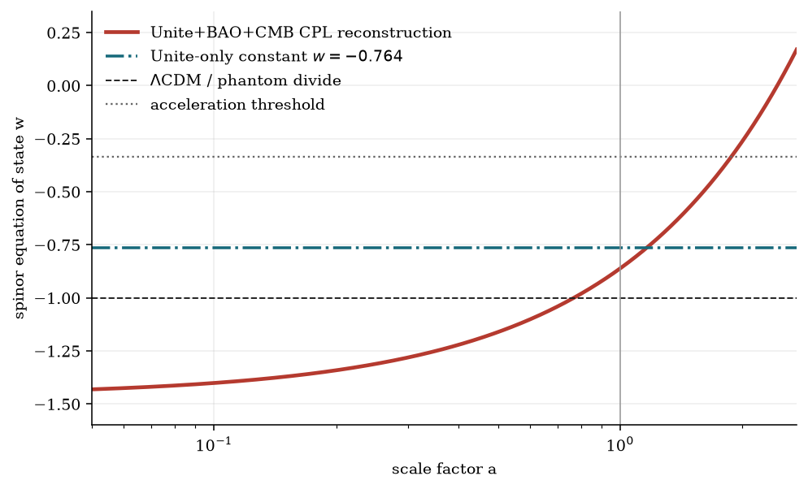
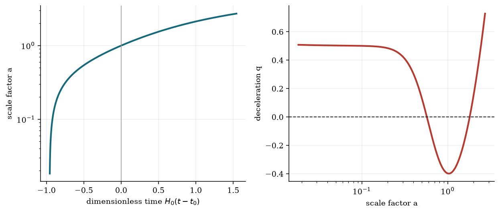

# The `gpt5_6` 16-component spinor cosmology

## Purpose and scientific status

This document defines and tests `gpt5_6`, a homogeneous nonlinear spinor
condensate that realizes a time-varying dark-energy equation of state in a flat
Friedmann-Lemaitre-Robertson-Walker (FLRW) universe. It provides a physical
field mechanism distinct from scalar-field quintessence: the pressure comes
from a self-interaction of a first-order Dirac field.

The construction is deliberately modest. It reconstructs a published central
background curve. It does not fit the supernova catalog, propagate the
published covariance, prove perturbative stability, or establish that the
field exists in nature.

## 1. Observational input

The supplied six-page PDF is a Gmail print discussing results from Camilleri et
al., *Supernovae Unite: Combining Pantheon+ and DES-SN5YR*,
arXiv:2609.05053v2. The email is not the full paper, so all numerical inputs
were checked against the official arXiv version.

Two fits must remain separate:

| Data combination | Cosmological model | Published central constraints |
|---|---|---|
| Unite supernovae only | flat constant-$w$ CDM | $\Omega_m=0.197^{+0.056}_{-0.054}$, $w=-0.764^{+0.078}_{-0.096}$ |
| Unite + BAO + CMB | flat $w_0w_a$ CDM | $\Omega_m=0.305\pm0.004$, $w_0=-0.861^{+0.044}_{-0.042}$, $w_a=-0.60^{+0.17}_{-0.19}$ |

The first row forces $w$ to be constant. The second uses the
Chevallier-Polarski-Linder (CPL) parameterization

$$
w(a)=w_0+w_a(1-a).
$$

This project reconstructs the central curve from the second row. It plots the
first row only as a separately labeled comparison. The paper reports weak
Bayesian evidence for evolving dark energy even where frequentist summaries
reach approximately $3.1$--$3.3\sigma$. Neither statistical statement is
evidence specifically for `gpt5_6`.

The demonstration also sets $\Omega_{r0}=9\times10^{-5}$ and
$H_0=70\,\mathrm{km\,s^{-1}\,Mpc^{-1}}$. These are numerical choices, not
additional Unite constraints. Dimensionless background results do not depend
on the chosen value of $H_0$.

## 2. Definition of the field

An irreducible Dirac spinor in $3+1$ dimensions has four complex components.
Define `gpt5_6` as four such flavors:

$$
\mathrm{gpt5\_6}\equiv\Psi=
\begin{pmatrix}\psi_1\\\psi_2\\\psi_3\\\psi_4\end{pmatrix}
\in\mathbb C^{16},
\qquad
\Gamma^\mu=I_4\otimes\gamma^\mu.
$$

With metric signature $(+---)$,

$$
\{\Gamma^\mu,\Gamma^\nu\}=2g^{\mu\nu}I_{16},
\qquad
\bar\Psi=\Psi^\dagger\Gamma^0.
$$

The 16 components therefore form a reducible four-flavor multiplet, not a new
irreducible Lorentz representation. The flavor-invariant scalar condensate is

$$
S=\bar\Psi\Psi=\sum_{A=1}^{4}\bar\psi_A\psi_A.
$$

For a homogeneous solution of the Dirac equation,

$$
\dot S+3HS=0,
\qquad
S(a)=S_0a^{-3}.
$$

Thus the condensate fills space and changes as the universe expands. The
function `gpt5_6(a)` supplies a convenient representative with this bilinear
and zero spatial current. A complete positive-$\Gamma^0$ solution also carries
an unobservable common background phase,

$$
\Psi(t)=a(t)^{-3/2}e^{-i\Theta(t)}\Psi_0,
\qquad
\dot\Theta=U_{,S}.
$$

That phase cancels from $S$, the vector current, and every background result in
this project. Its dimensional normalization would require a physical choice of
$S_0$; here $S/S_0$ is the dimensionless background variable.

## 3. Action and field equations

Use natural units $c=\hbar=1$, $\kappa=8\pi G$, and the torsion-free spinor
covariant derivative $\nabla_\mu$. The action is

$$
\mathcal S=\int d^4x\sqrt{-g}\left[
\frac{R}{2\kappa}+\mathcal L_\Psi\right]
+\mathcal S_m+\mathcal S_r,
$$

where

$$
\mathcal L_\Psi=
\frac{i}{2}\left[
\bar\Psi\Gamma^\mu\nabla_\mu\Psi
-(\nabla_\mu\bar\Psi)\Gamma^\mu\Psi
\right]-U(S).
$$

The symmetrized derivative makes the classical Lagrangian Hermitian. Varying
$\bar\Psi$ gives

$$
i\Gamma^\mu\nabla_\mu\Psi-U_{,S}\Psi=0,
$$

and varying $\Psi$ gives its adjoint. Metric or tetrad variation gives the
symmetric energy-momentum tensor

$$
\begin{aligned}
T_{\mu\nu}={i\over4}\big[&
\bar\Psi\Gamma_\mu\nabla_\nu\Psi
+\bar\Psi\Gamma_\nu\nabla_\mu\Psi\\
&-(\nabla_\mu\bar\Psi)\Gamma_\nu\Psi
-(\nabla_\nu\bar\Psi)\Gamma_\mu\Psi\big]
-g_{\mu\nu}\mathcal L_\Psi.
\end{aligned}
$$

The field equations imply $\nabla_\mu T^{\mu\nu}=0$ on shell.

## 4. Kinetic term, potential, density, pressure, and $w$

Define the first-order Dirac kinetic density

$$
K_D=\frac{i}{2}\left[
\bar\Psi\Gamma^\mu\nabla_\mu\Psi
-(\nabla_\mu\bar\Psi)\Gamma^\mu\Psi
\right].
$$

Using the field equations in a homogeneous FLRW background gives

$$
K_D=SU_{,S}.
$$

The perfect-fluid tensor is

$$
T^\mu{}_{\nu}=\operatorname{diag}(\rho_\Psi,-p_\Psi,-p_\Psi,-p_\Psi),
$$

with

$$
\boxed{\rho_\Psi=U(S)},
\qquad
\boxed{p_\Psi=SU_{,S}-U(S)},
$$

$$
\boxed{w_\Psi={p_\Psi\over\rho_\Psi}
=-1+{SU_{,S}\over U}}.
$$

The on-shell Lagrangian is $\mathcal L_\Psi=p_\Psi$. The word *kinetic*
must be handled carefully: $K_D$ is first order and is not a separately
positive energy such as $\dot\phi^2/2$ for a canonical scalar. In fact, the
chosen background has $K_D<0$ before its $w=-1$ crossing. This is why calling
the complete history canonical quintessence would be incorrect.

## 5. Reconstructing the nonlinear potential

Energy conservation for an independently conserved homogeneous component is

$$
{d\rho_\Psi\over d\ln a}=-3[1+w(a)]\rho_\Psi.
$$

For CPL this integrates exactly:

$$
\rho_\Psi(a)=\rho_{\Psi0}
a^{-3(1+w_0+w_a)}
\exp[-3w_a(1-a)].
$$

Since $a=(S_0/S)^{1/3}$, choose

$$
\boxed{
U(S)=\rho_{\Psi0}
\left({S\over S_0}\right)^{1+w_0+w_a}
\exp\left[-3w_a\left(
1-\left({S_0\over S}\right)^{1/3}
\right)\right]
}.
$$

Logarithmic differentiation gives

$$
{SU_{,S}\over U}=1+w_0+w_a-w_a
\left({S_0\over S}\right)^{1/3}=1+w(a),
$$

and therefore the stress tensor reproduces the CPL curve exactly. This proves
background equivalence. It does not prove equivalence of perturbations or
uniqueness of the microscopic theory.

## 6. Numerical problem, step by step

### 6.1 Variables

Use e-fold time $N=\ln a$ and dimensionless cosmic time
$\tau=H_0(t-t_0)$. Integrate the state

$$
\mathbf y(N)=(\tau,S,\rho_\Psi/\rho_{c0}).
$$

Flatness fixes

$$
\Omega_{\Psi0}=1-\Omega_{m0}-\Omega_{r0}=0.69491.
$$

### 6.2 ODEs

The Friedmann function is

$$
E^2(N)={H^2\over H_0^2}=
\Omega_{r0}e^{-4N}+\Omega_{m0}e^{-3N}
+{\rho_\Psi\over\rho_{c0}}.
$$

The solver advances

$$
{d\tau\over dN}={1\over E},
\qquad
{dS\over dN}=-3S,
\qquad
{d(\rho_\Psi/\rho_{c0})\over dN}
=-3[1+w(e^N)]{\rho_\Psi\over\rho_{c0}}.
$$

### 6.3 Initial conditions and interval

At the present epoch $N=0$:

$$
\tau(0)=0,
\qquad S(0)=S_0=1,
\qquad \rho_\Psi(0)/\rho_{c0}=0.69491.
$$

The code integrates from $N=0$ backward to $N=-4$ and separately forward to
$N=1$, then joins the arrays. This covers
$0.0183\lesssim a\lesssim2.718$ with 1201 output points. SciPy's explicit
DOP853 integrator uses relative tolerance $10^{-11}$ and absolute tolerance
$10^{-13}$.

### 6.4 Independent checks

The numerical arrays are compared with three analytic identities:

$$
S=S_0a^{-3},
\qquad
\rho_\Psi=U(S),
\qquad
E^2=\Omega_{r0}a^{-4}+\Omega_{m0}a^{-3}+U/\rho_{c0}.
$$

The measured maximum relative errors are

| Check | Maximum relative error |
|---|---:|
| bilinear dilution | $4.5232\times10^{-11}$ |
| density reconstruction | $2.2269\times10^{-11}$ |
| Friedmann closure | $1.7988\times10^{-12}$ |

These are numerical consistency tests, not estimates of physical uncertainty.

## 7. Results

At $a=1$:

| Quantity | Value in units of $\rho_{c0}$ |
|---|---:|
| $U=\rho_\Psi$ | $0.69491000$ |
| $K_D=SU_{,S}=\rho_\Psi+p_\Psi$ | $0.09659249$ |
| $p_\Psi=\mathcal L_\Psi$ | $-0.59831751$ |
| $w_\Psi$ | $-0.86100000$ |

Selected equation-of-state values are

$$
w(0.1)=-1.401,
\qquad w(1)=-0.861,
\qquad w(2)=-0.261.
$$

### 7.1 Phantom and null-energy boundary

The analytic CPL crossing is

$$
a_{w=-1}=1+{1+w_0\over w_a}=0.76833333,
\qquad z=0.30151844.
$$

Because

$$
\rho_\Psi+p_\Psi=SU_{,S}=\rho_\Psi(1+w),
$$

the same point is the homogeneous null-energy-condition boundary. The numerical
NEC root is $a=0.76833334$. The central curve has $\rho+p<0$ before that root
and $\rho+p>0$ afterward. By contrast, the separate constant-$w=-0.764$
benchmark never crosses $w=-1$.

### 7.2 Acceleration

For all components together,

$$
q=-{\ddot a\over aH^2}
=\frac12\left(1+3{p_{\mathrm{tot}}\over\rho_{\mathrm{tot}}}\right).
$$

The roots are

| Event | $a$ | $z=a^{-1}-1$ |
|---|---:|---:|
| acceleration begins | $0.57194538$ | $0.74841869$ |
| formal future acceleration ends | $1.80120338$ | $-0.44481561$ |

The first transition lies in the past. The second follows only from extending
the linear-in-$a$ CPL formula into the future and is not an observational
forecast.







## 8. Connection to dark energy

The reconstructed component has three dark-energy properties at the background
level:

1. Its density is spatially homogeneous in the FLRW approximation.
2. Its pressure is negative today.
3. Together with matter and radiation, it makes $q<0$ over the present epoch.

It is therefore a mathematically valid effective dark-energy mechanism. Unlike
canonical scalar quintessence, its first-order kinetic structure permits the
central reconstructed history to pass through $w=-1$. That ability does not
automatically make the theory stable. A perturbative analysis of the complete
fermionic system is required before treating the NEC-violating region as a
viable fundamental model.

## 9. Connection to dark matter

The relation to dark matter is a different parameter regime. If

$$
U(S)=mS,
$$

then

$$
p=SU_{,S}-U=0,
\qquad w=0,
\qquad \rho=mS\propto a^{-3}.
$$

Thus a nonlinear spinor condensate can reproduce pressureless matter at the
homogeneous level. A potential such as $U=\Lambda+mS$ can mix constant and
dust-like background terms. This is a structural connection, not a result that
the present reconstruction is dark matter.

In this calculation, $\Omega_{m0}a^{-3}$ is already a separate fluid. Calling
the same `gpt5_6` density all of the dark matter would double-count matter. A
unified dark-sector proposal would require a new parameter fit plus successful
tests of clustering, sound speed, CMB anisotropies, lensing, and structure
growth.

## 10. Limitations

- The field is a four-flavor effective multiplet, not a newly discovered
  irreducible spin representation.
- Only a homogeneous scalar condensate is modeled. Isotropy is imposed at the
  background level.
- The potential is reverse-engineered from CPL. Other fields and potentials can
  produce the same $H(a)$.
- No observational likelihood, nuisance parameters, covariance matrix, or
  uncertainty bands are computed.
- No scalar, vector, tensor, or fermionic perturbation equations are solved.
- Ghost, gradient, causal, radiative, and strong-coupling stability are not
  established.
- The future CPL behavior is an extrapolation outside the fitted redshift
  domain.
- $S_0=1$ is a background normalization. A particle-physics interpretation
  needs a dimensionful condensate scale and couplings.

## 11. Complete setup and reproduction

### Linux and macOS

From the repository root:

```bash
python3 -m venv .venv
.venv/bin/python -m pip install --upgrade pip
.venv/bin/python -m pip install -r requirements.txt
```

Run the tests and regenerate the numerical artifacts:

```bash
.venv/bin/python -m pytest tests/test_gpt5_6_cosmology.py -q
.venv/bin/python scripts/run_cosmology.py
```

Build, execute, and export the notebook:

```bash
.venv/bin/python scripts/build_cosmology_notebook.py
.venv/bin/python -m jupyter nbconvert --to notebook --execute --inplace \
  notebooks/gpt5_6_cosmology.ipynb --ExecutePreprocessor.timeout=180 \
  --ExecutePreprocessor.record_timing=False
.venv/bin/python -m jupyter nbconvert --to html --output-dir build \
  notebooks/gpt5_6_cosmology.ipynb
```

Build the PDF report with TeX Live or another `pdflatex` distribution:

```bash
bash scripts/build_documentation.sh
```

### Windows PowerShell

```powershell
py -3 -m venv .venv
.venv\Scripts\python.exe -m pip install --upgrade pip
.venv\Scripts\python.exe -m pip install -r requirements.txt
.venv\Scripts\python.exe -m pytest tests/test_gpt5_6_cosmology.py -q
.venv\Scripts\python.exe scripts/run_cosmology.py
.venv\Scripts\python.exe scripts/build_cosmology_notebook.py
.venv\Scripts\python.exe -m jupyter nbconvert --to notebook --execute --inplace notebooks/gpt5_6_cosmology.ipynb --ExecutePreprocessor.timeout=180 --ExecutePreprocessor.record_timing=False
.venv\Scripts\python.exe -m jupyter nbconvert --to html --output-dir build notebooks/gpt5_6_cosmology.ipynb
```

Compile `docs/gpt5_6_cosmology.tex` twice with `pdflatex` if Bash is not
available.

### Expected outputs

- `10 passed` from the focused Python suite.
- No error outputs in the executed Jupyter notebook.
- `artifacts/gpt5_6_summary.json` with the benchmark records and diagnostics.
- Four PNG/PDF figure pairs in `artifacts/figures/`.
- `build/gpt5_6_cosmology.html`.
- `docs/gpt5_6_cosmology.pdf`.

## 12. rustSolveIt and SUNDIALS 7.8.0

The Linux rustSolveIt repository requested for consideration was inspected. It
contains a pure-Rust SUNDIALS 7.8.0 translation, a mechanics-oriented notebook
language, and a Jupyter wrapper. It does not expose a drop-in Python ODE API for
this custom FLRW state vector. Direct use would require a large external clone,
a separate Rust executable, and a Python/Rust data bridge.

The present system is smooth, nonstiff, has only three state variables, and has
closed-form invariants. DOP853 reaches relative errors near $10^{-11}$, so that
additional dependency would add complexity without a numerical benefit for this
calculation. A future stiff perturbation system could justify a dedicated CVODE
implementation. See the provenance record for the assessed repository and
version.

## References

1. R. Camilleri et al., *Supernovae Unite: Combining Pantheon+ and DES-SN5YR*,
   arXiv:2609.05053v2, Sections 7.0.3--7.0.4,
   <https://arxiv.org/abs/2609.05053>.
2. Y.-F. Cai and J. Wang, *Dark Energy Model with Spinor Matter and Its Quintom
   Scenario*, Class. Quantum Grav. **25** (2008) 165014,
   <https://arxiv.org/abs/0806.3890>.
3. M. Chevallier and D. Polarski, *Accelerating Universes with Scaling Dark
   Matter*, Int. J. Mod. Phys. D **10** (2001) 213--224.
4. E. V. Linder, *Exploring the Expansion History of the Universe*, Phys. Rev.
   D **68** (2003) 083504, <https://arxiv.org/abs/astro-ph/0208512>.
5. once-ere, *rustSolveIt on pure-Rust SUNDIALS 7.8.0 for Ubuntu Linux*,
   <https://github.com/once-ere/rustSolveIt_linux_SUNDIALS_7_8_0>.
