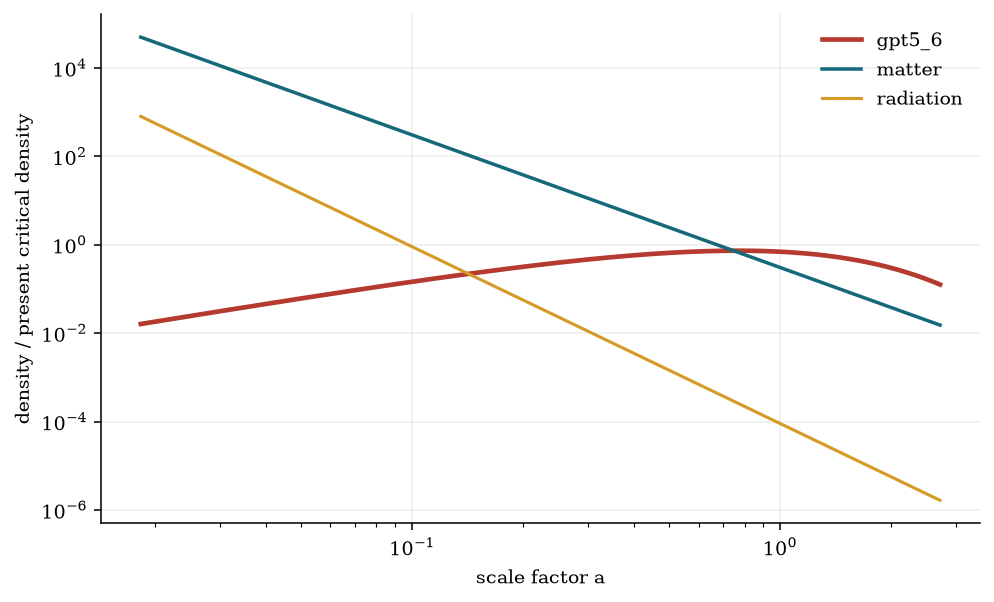
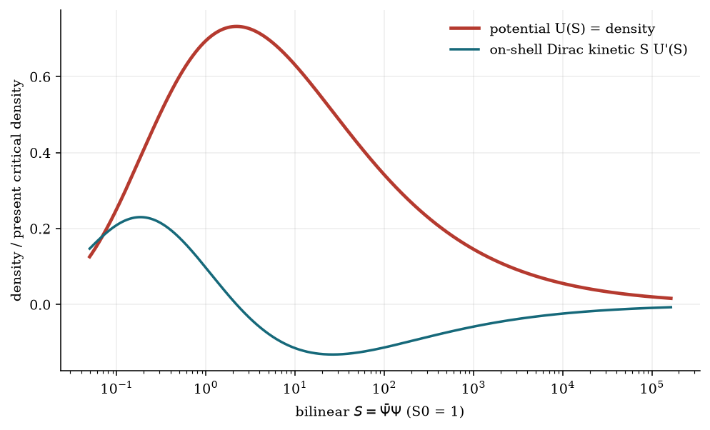

# The `gpt5_6` spinor and the dark sector

## Relationships, conclusions, and claim boundaries

This note isolates what the repository establishes about the relationship
between the 16-component Dirac field `gpt5_6`, dark energy, and dark matter.
It separates exact mathematical identities from model interpretations and
from questions that require new calculations.

The central conclusion is precise:

> A nonlinear Dirac condensate can reproduce dark-matter-like, vacuum-like,
> or evolving-dark-energy-like homogeneous stress tensors through the choice
> of its scalar potential. The 16-component construction supplies four Dirac
> flavors, but it does not by itself prove that one field is both dark matter
> and dark energy. In the implemented CPL reconstruction, `gpt5_6` is the
> effective dark-energy component and matter remains a separate fluid.

## 1. What the 16 components mean

The field is

$$
\Psi=
\begin{pmatrix}
\psi_1\\ \psi_2\\ \psi_3\\ \psi_4
\end{pmatrix}
\in\mathbb C^{16},
\qquad
\Gamma^\mu=I_4\otimes\gamma^\mu.
$$

Each $\psi_A$ is an ordinary four-component Dirac spinor. Therefore
`gpt5_6` is a reducible four-flavor multiplet, not a new 16-dimensional
irreducible Lorentz spinor. Its flavor-invariant scalar is

$$
S=\bar\Psi\Psi=\sum_{A=1}^{4}\bar\psi_A\psi_A.
$$

The current model uses a potential $U(S)$ that depends on this total scalar.
At the homogeneous level, gravity consequently sees the sum $S$, not a unique
dark-sector role for each flavor. Sixteen components do not mean sixteen
fluids, and the flavor count alone creates neither negative pressure nor
pressureless matter.

## 2. The exact field-to-fluid map

The torsion-free matter Lagrangian is

$$
\mathcal L_\Psi=
\frac{i}{2}\left[
\bar\Psi\Gamma^\mu\nabla_\mu\Psi
-(\nabla_\mu\bar\Psi)\Gamma^\mu\Psi
\right]-U(S).
$$

For a homogeneous configuration in flat FLRW spacetime, the Dirac equations
give

$$
\dot S+3HS=0,
\qquad
S=S_0a^{-3}.
$$

The on-shell stress tensor is a perfect fluid with

$$
\rho_\Psi=U(S),
\qquad
p_\Psi=SU_{,S}-U(S),
\qquad
K_D=SU_{,S}=\rho_\Psi+p_\Psi.
$$

Hence

$$
w_\Psi=\frac{p_\Psi}{\rho_\Psi}
=-1+\frac{SU_{,S}}{U}
=-1+\frac{d\ln U}{d\ln S}.
$$

This logarithmic-slope identity is the central relationship. Expansion fixes
$S(a)$, and the shape of $U(S)$ fixes the effective equation of state. It also
implies the continuity equation

$$
\dot\rho_\Psi+3H(\rho_\Psi+p_\Psi)=0.
$$

These statements are derived from the action and do not depend on a numerical
fit.

## 3. How one potential family spans dark-sector behavior

### 3.1 Power laws

For

$$
U(S)=\lambda S^n,
$$

the field-to-fluid map becomes

$$
w_\Psi=n-1,
\qquad
\rho_\Psi\propto a^{-3n}=a^{-3(1+w_\Psi)}.
$$

Important limits are:

| Potential | Background behavior | Interpretation |
|---|---|---|
| $U=mS$ | $p=0$, $w=0$, $\rho\propto a^{-3}$ | pressureless-matter limit |
| $U=\Lambda$ | $p=-\rho$, $w=-1$, $\rho=$ constant | vacuum-energy limit |
| $U=\lambda S^n$, $0<n<2/3$ | $-1<w<-1/3$ | accelerating, quintessence-like background |
| decreasing $U(S)$ with $U>0$ | $SU_{,S}<0$, $w<-1$ | phantom-like background |

These are background equivalences. They do not establish the perturbation
properties, particle interpretation, or stability of the corresponding
spinor theory.

### 3.2 A minimal unified background

The additive potential

$$
U(S)=\Lambda+mS
$$

gives

$$
\rho_\Psi=\Lambda+mS_0a^{-3},
\qquad
p_\Psi=-\Lambda,
\qquad
w_\Psi(a)=-\frac{\Lambda}{\Lambda+mS_0a^{-3}}.
$$

It is matter-like when $a$ is small and vacuum-like when $a$ is large. At the
homogeneous level this single condensate exactly reproduces the sum of a dust
term and a cosmological constant. More generally, each term in
$U(S)=\sum_n\lambda_nS^n$ contributes the background scaling of a
constant-$w=n-1$ fluid.

This is the cleanest mathematical connection between spinor dark matter and
spinor dark energy. It is also observationally degenerate with the matching
standard-fluid background. Calling it a physical unification requires its
perturbations and interactions to behave correctly; an algebraic split of
$U$ is not yet evidence for a unified microscopic sector.

## 4. What the implemented reconstruction represents

The repository does not implement $U=\Lambda+mS$ as a unified fit. It
reconstructs a nonlinear potential from the combined Unite+BAO+CMB central CPL
history

$$
w(a)=w_0+w_a(1-a),
\qquad
(w_0,w_a)=(-0.861,-0.60).
$$

Energy conservation gives

$$
\rho_\Psi(a)=\rho_{\Psi0}
a^{-3(1+w_0+w_a)}
\exp\left[3w_a(a-1)\right].
$$

Using $a=(S_0/S)^{1/3}$ produces the reconstructed spinor potential

$$
U(S)=\rho_{\Psi0}
\left(\frac{S}{S_0}\right)^{1+w_0+w_a}
\exp\left\{3w_a\left[
\left(\frac{S_0}{S}\right)^{1/3}-1
\right]\right\}.
$$

The FLRW equation used in the calculation is

$$
\frac{H^2}{H_0^2}
=\Omega_{r0}a^{-4}+\Omega_{m0}a^{-3}
+\frac{U(S_0a^{-3})}{\rho_{c0}},
$$

with $\Omega_{r0}=0.00009$, $\Omega_{m0}=0.305$, and
$\Omega_{\Psi0}=0.69491$. The $\Omega_{m0}a^{-3}$ term is already the matter
sector. Therefore, in this implemented model:

- `gpt5_6` is assigned to effective evolving dark energy;
- dark matter is included in the separate matter density;
- relabeling `gpt5_6` as all dark matter would double-count matter;
- a unified interpretation would be a different model and require a new fit.

## 5. Numerical conclusions from the current central curve

At $a=1$, the reconstructed field has

| Quantity | Value in units of $\rho_{c0}$ |
|---|---:|
| $\rho_\Psi=U$ | $0.69491000$ |
| $p_\Psi$ | $-0.59831751$ |
| $K_D=\rho_\Psi+p_\Psi$ | $0.09659249$ |
| $w_\Psi$ | $-0.86100000$ |

The central CPL curve crosses $w=-1$ at

$$
a=0.76833333,
\qquad
z=0.30151844.
$$

Because $\rho_\Psi+p_\Psi=SU_{,S}=\rho_\Psi(1+w_\Psi)$, this is also the
homogeneous null-energy-condition boundary. The complete radiation, matter,
and spinor background begins accelerating at

$$
a=0.57194538,
\qquad
z=0.74841869.
$$

The formal future end of acceleration at $a=1.80120338$ is a consequence of
extending the linear-in-$a$ CPL expression beyond its fitted domain. It is not
an observational forecast.





## 6. What can and cannot be concluded

### Established in this repository

1. Four ordinary Dirac flavors form the defined 16-component multiplet and
   satisfy the enlarged Clifford algebra.
2. Its homogeneous scalar bilinear dilutes exactly as $a^{-3}$.
3. A potential $U(S)$ maps to a perfect-fluid background through
   $\rho=U$ and $p=SU_{,S}-U$.
4. Linear, constant, additive, and reconstructed nonlinear potentials connect
   the same field framework to dust, vacuum energy, mixed dark-sector
   backgrounds, and evolving dark energy.
5. The implemented nonlinear potential reproduces the prescribed central CPL
   history and closes the Friedmann equation numerically to about $10^{-12}$.

### Not established

1. The expansion history does not identify a spinor uniquely. The potential
   was reconstructed from that history, so scalar fields and fluids can share
   the same $H(a)$.
2. A pressureless homogeneous limit is not sufficient for dark matter. Cold
   dark matter must cluster with acceptable effective sound speed and
   anisotropic stress and must satisfy CMB, lensing, and structure-growth
   constraints.
3. Negative pressure is not sufficient for fundamental dark energy. The
   fermionic perturbations must be ghost-free, gradient-stable, causal, and
   under radiative control, especially across the NEC boundary.
4. No flavor-resolved dynamics currently assigns some of the four spinors to
   dark matter and others to dark energy. Since $U$ depends on total $S$, such
   an assignment is not defined by the present action.
5. No raw cosmological likelihood or model comparison favors `gpt5_6` over
   standard dark-sector models.

## 7. A falsifiable route to a unified model

A serious unified-dark-sector extension should:

1. specify whether $U$ depends on total $S$ or on separate bilinears $S_A$;
2. define flavor symmetries, masses, cross-couplings, and a dimensionful
   condensate normalization;
3. derive the quadratic action and all linearized fermionic and metric
   perturbation equations;
4. test ghost, gradient, causal, and strong-coupling conditions;
5. compute effective sound speed, anisotropic stress, and subhorizon growth;
6. evolve CMB, lensing, and matter-power observables in a Boltzmann solver;
7. fit supernova, BAO, CMB, lensing, and structure-growth data without a
   separately double-counted matter term;
8. compare the evidence with Lambda-CDM and simpler evolving-dark-energy
   models.

Until those checks are passed, the defensible result is a verified
field-to-background correspondence and a concrete research hypothesis, not a
dark-sector discovery.

## 8. Reproducibility and sources

The equations and values in this note are traceable to:

- [complete derivation](gpt5_6_cosmology.md);
- [authoritative Python implementation](../src/gpt5_6_cosmology.py);
- [executed notebook](../notebooks/gpt5_6_cosmology.ipynb);
- [generated numerical summary](../artifacts/gpt5_6_summary.json);
- [provenance and exclusions](../PROVENANCE.md).

Build both PDFs and run every repository check with:

```bash
bash scripts/build_documentation.sh
bash scripts/verify_all.sh
```

### References

1. R. Camilleri et al., *Supernovae Unite: Combining Pantheon+ and DES-SN5YR*,
   arXiv:2609.05053v2, <https://arxiv.org/abs/2609.05053>.
2. Y.-F. Cai and J. Wang, *Dark Energy Model with Spinor Matter and Its Quintom
   Scenario*, Class. Quantum Grav. **25** (2008) 165014,
   <https://arxiv.org/abs/0806.3890>.
3. M. Chevallier and D. Polarski, *Accelerating Universes with Scaling Dark
   Matter*, Int. J. Mod. Phys. D **10** (2001) 213-224.
4. E. V. Linder, *Exploring the Expansion History of the Universe*, Phys. Rev.
   D **68** (2003) 083504, <https://arxiv.org/abs/astro-ph/0208512>.